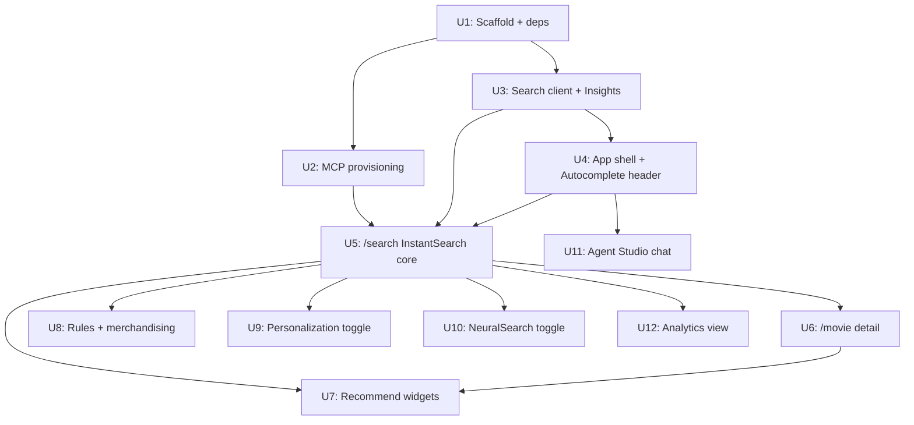

# feat: Algolia movie demo (InstantSearch, Recommend, Personalization, Rules, NeuralSearch, Agent Studio)

> **Plan philosophy.** Decisions, not code. File paths and patterns, not implementations. Test scenarios named so the implementer doesn't have to invent coverage. Pseudo-code in this doc is directional only — never the contract.

---

## Summary

Build a Next.js 16 App Router demo app that exercises Algolia's product surface end-to-end against the public Algolia movies sample dataset. No auth, no login, no payments — a pure showcase for InstantSearch, Autocomplete + Query Suggestions, Recommend, Personalization, Rules, NeuralSearch, and Agent Studio. The app stays a thin client of Algolia; the only "backend" is a build-time provisioning workflow that uses Algolia MCP (with a Node script fallback) to push records and configure the index.

The UI is built with shadcn/ui scaffolded from a specific preset registry, not Satellite (per project override on 2026-05-26).

---

## Problem Frame

**Who:** the user (an Algolia design/product engineer) and anyone they demo to.

**Why:** Algolia ships many products that look great in isolation but are easier to evaluate, compare, and demo when wired together against a single dataset. A movie catalog is a high-recognition, low-cognitive-load domain — viewers immediately understand "find action movies from the 90s" or "movies about lonely robots."

**What's missing today:** there's no single playground that puts InstantSearch + Recommend + Personalization + Rules + NeuralSearch + Agent Studio in one consistent shell. Algolia's hosted demos cover individual products but don't compose them. This plan produces that playground.

**What we are NOT doing:**
- Real authentication, user accounts, watchlists that persist across devices.
- Real-time streaming, playback, or DRM (movie data is metadata only — title, year, genres, poster, score).
- Production-grade analytics dashboards (we surface a small slice of the Algolia Analytics API, nothing custom).
- Bring-your-own-data (the dataset is fixed: Algolia's public `movies.json`).
- Multi-tenant or per-user index isolation.

---

## Scope Boundaries

### In scope (this product's identity)

- A Next.js 16 App Router app deployed to Vercel.
- Build-time index provisioning via Algolia MCP, with a Node-based script as a supported fallback (because Algolia labels MCP as experimental / not officially supported for production / CI use).
- The eight Algolia surfaces: InstantSearch core, faceting, Autocomplete + Query Suggestions, Recommend, Personalization + Insights, Rules + merchandising, NeuralSearch, Agent Studio chat.
- A small analytics view backed by Algolia's Analytics API.
- shadcn/ui as the design system, scaffolded via the specific preset `b5tK8n7Btg`.
- Anonymous user token persisted in `localStorage` for personalization continuity within a browser.

### Deferred for later

- Watchlists / favorites that persist server-side.
- Multi-language search (movies dataset is English-only).
- A/B testing UI (Algolia A/B Testing exists but adds operational weight; punt unless explicitly requested).
- Custom Recommend training pipelines — we use whatever the dashboard ships out of the box.
- "Bring-your-own-dataset" upload UX.

### Deferred to follow-up work (in this repo, after the demo lands)

- Replace MCP-provisioning with a CI-friendly `algoliasearch` v5 script if the team wants reproducible cold starts.
- Pre-seeded Insights event history fixture for NeuralSearch and Personalization training (so demos work in a fresh sandbox app without waiting for live traffic).
- Visual regression snapshots of the search page across viewports.

### Outside this product's identity

- Becoming a real streaming service. Movie cards link to nothing — no trailers, no playback.
- Becoming a CMS for movies. Records are read-only at runtime.
- Replacing Algolia's hosted dashboards.

---

## Key Technical Decisions

### 1. MCP runs at build-time only; runtime uses standard Algolia search clients

Algolia MCP is an agent-protocol tool — browsers can't speak MCP, and even a server proxy that translates MCP calls per query would add latency without buying anything over Algolia's regular search API. We use MCP for what it's good at: interactive provisioning. The browser talks directly to Algolia's search API via `algoliasearch` v5 + `react-instantsearch` v7.

Algolia explicitly labels MCP as "experimental, not officially supported, not an API client for SLA purposes." So we ship a thin Node script (`scripts/provision.ts`) using the supported `algoliasearch` v5 client as a fallback. Either path produces the same end-state index.

### 2. shadcn/ui via preset `b5tK8n7Btg`, not Satellite

The user's global CLAUDE.md mandates Satellite as the laptop-wide default UI library. For this project they have explicitly overridden that with shadcn scaffolded from preset `b5tK8n7Btg`. Treat the preset as authoritative — the components, colors, and typography it ships are the design system, period. Do not pull in Satellite, MUI, Chakra, Mantine, or anything else.

### 3. Next.js 16 App Router + `InstantSearchNext`

`react-instantsearch-nextjs` ships `InstantSearchNext`, a drop-in replacement for `<InstantSearch>` that handles App Router SSR + URL routing. Use it. Do not mix `next/router` (Pages Router) imports or roll a custom SSR bridge. The whole search UI tree is a Client Component; the route file itself is a Server Component that simply renders the client tree.

### 4. Autocomplete-JS for the global header search, InstantSearch for `/search`

`@algolia/autocomplete-js` is a separate library from InstantSearch. It owns the dropdown rendering for the global header (federated movies + Query Suggestions + Recent Searches). Selecting a suggestion pushes to `/search?...` so InstantSearch takes over for the full results page. Two libraries, one continuous experience.

### 5. Recommend widgets come from `react-instantsearch` (not `@algolia/recommend-react`)

The standalone `@algolia/recommend-react` package is deprecated in 2026. Recommend widgets (`RelatedProducts`, `TrendingItems`, `FrequentlyBoughtTogether`) are now first-class inside `react-instantsearch` and share the same `searchClient`. Do not install the deprecated package.

### 6. Anonymous user token persisted in `localStorage`

For Personalization continuity within a browser, generate a `userToken` once (`anon-${crypto.randomUUID()}`), persist in `localStorage`, and pass it to both `search-insights` (`aa("setUserToken", token)`) and InstantSearch (`<Configure userToken={token} ... />`). No cookies, no server state, no auth.

### 7. NeuralSearch is opt-in and requires a sandbox app with events history

NeuralSearch is an index setting (`mode: "neuralSearch"`), not a separate API. Enabling it requires ≥1000 click events or ≥100 conversion events in the last 30 days. A fresh demo app will not meet this bar. The plan supports two paths: (a) point the demo at an existing sandbox Algolia app that already has events history, or (b) accept that NeuralSearch shows a "needs more data" state and document how to enable it later.

### 8. Agent Studio integration via Vercel AI SDK v5

Agent Studio exposes a streaming completions endpoint that is compatible with the Vercel AI SDK (`compatibilityMode=ai-sdk-5`). There is no separate npm package. Use `ai` v5 + `@ai-sdk/react`'s `useChat` with a `DefaultChatTransport` pointing to the agent URL. The agent itself is configured in the Algolia dashboard (out of code) and grounded against the `movies` index.

### 9. Sandbox-or-own-app split

Two operating modes, switched via env vars:

- **`Sandbox` mode** — uses Algolia's public `latency` app and the canonical `instant_search` / `movies` indices. Zero setup. Read-only. No write/provisioning. No real Personalization or NeuralSearch (we don't own that app), no custom Rules.
- **`Owned` mode** — the user's own Algolia app. Full features. Requires running provisioning first (MCP or script).

Default to `Owned` for development once provisioning has run. `Sandbox` is the fallback so the app shell remains usable without an Algolia account.

---

## High-Level Technical Design

> This illustrates intended approach and is directional guidance for review, not implementation specification.

```
┌──────────────────────────────────────────────────────────────────────────┐
│ BUILD-TIME (developer's machine, run once or as needed)                  │
│                                                                          │
│  algolia/datasets/movies.json  ─┐                                        │
│                                  ├──► MCP (interactive) ──► Algolia app  │
│  algolia/datasets/settings.json─┘    OR scripts/provision.ts (CLI)       │
│                                                                          │
│  Provisions: movies index, replicas (year_desc, rating_desc),            │
│              movies_query_suggestions, sample Rules, Recommend models    │
└──────────────────────────────────────────────────────────────────────────┘

┌──────────────────────────────────────────────────────────────────────────┐
│ RUNTIME (browser)                                                        │
│                                                                          │
│   shadcn/ui shell                                                        │
│   ├─ Header                                                              │
│   │   └─ @algolia/autocomplete-js  ──► movies + Query Suggestions +     │
│   │                                    Recent Searches                   │
│   ├─ / (homepage)                                                        │
│   │   └─ <TrendingItems> + curated rails                                │
│   ├─ /search                                                             │
│   │   └─ <InstantSearchNext>                                            │
│   │       ├─ SearchBox, RefinementList, HierarchicalMenu, RangeInput   │
│   │       ├─ SortBy (replicas), CurrentRefinements, Pagination         │
│   │       └─ <Configure clickAnalytics enablePersonalization userToken/>│
│   ├─ /movie/[objectID]                                                  │
│   │   ├─ Movie detail (server-fetched single record)                   │
│   │   ├─ <RelatedProducts>                                              │
│   │   └─ <FrequentlyBoughtTogether>                                     │
│   ├─ /agent                                                              │
│   │   └─ useChat (AI SDK v5) ──► Agent Studio REST                      │
│   └─ /analytics                                                          │
│       └─ Algolia Analytics API (top searches, no-results, CTR)         │
│                                                                          │
│   Shared: lib/algolia.ts (searchClient, userToken, insights init)       │
└──────────────────────────────────────────────────────────────────────────┘
```

### Dependency graph for implementation units



---

## Output Structure

Greenfield repo. Expected layout after all units land:

```
Movie App/
├── app/
│   ├── layout.tsx                     # Root layout, providers, fonts
│   ├── page.tsx                       # Homepage (trending + curated rails)
│   ├── search/
│   │   ├── page.tsx                   # Server Component shell
│   │   └── SearchExperience.tsx       # "use client" InstantSearchNext tree
│   ├── movie/
│   │   └── [objectID]/
│   │       └── page.tsx               # Detail (server-fetched) + Recommend
│   ├── agent/
│   │   └── page.tsx                   # Agent Studio chat
│   ├── analytics/
│   │   └── page.tsx                   # Analytics dashboard
│   └── api/
│       └── analytics/route.ts         # Server route fetching Analytics API
├── components/
│   ├── ui/                            # shadcn primitives (preset b5tK8n7Btg)
│   ├── search/
│   │   ├── AutocompleteHeader.tsx     # Header search bar
│   │   ├── MovieHit.tsx               # Hit card
│   │   ├── MoviePosterTile.tsx        # Recommend item renderer
│   │   ├── FacetSidebar.tsx           # Refinement panel
│   │   ├── NeuralSearchToggle.tsx     # Index mode switcher
│   │   └── PersonalizationToggle.tsx  # Token / strategy switch
│   ├── recommend/
│   │   ├── TrendingRail.tsx
│   │   ├── RelatedRail.tsx
│   │   └── FrequentlyBoughtTogetherRail.tsx
│   ├── rules/
│   │   └── PinnedBanner.tsx           # Renders banner content from Rule
│   ├── agent/
│   │   └── AgentChat.tsx
│   └── shell/
│       ├── Header.tsx
│       └── Footer.tsx
├── lib/
│   ├── algolia.ts                     # searchClient, indexName helpers
│   ├── insights.ts                    # search-insights init, event helpers
│   ├── userToken.ts                   # localStorage anon token
│   └── env.ts                         # validated env (sandbox vs owned)
├── scripts/
│   ├── provision.ts                   # Node fallback provisioner
│   └── seed-events.ts                 # Optional: seed Insights events
├── docs/
│   ├── plans/
│   │   └── 2026-05-26-001-feat-algolia-movie-demo-plan.md  # this file
│   └── mcp/
│       └── provisioning-runbook.md    # MCP-driven setup walkthrough
├── public/
│   └── placeholder-poster.svg
├── tests/
│   ├── e2e/                           # Playwright smoke tests
│   └── unit/
├── .env.example
├── components.json                    # shadcn config (written by preset)
├── tailwind.config.ts                 # may be omitted if preset uses CSS-only
├── next.config.ts
├── package.json
├── pnpm-lock.yaml
└── README.md
```

The implementer may adjust this layout if the shadcn preset's scaffolding pushes a different structure (e.g. it may colocate components differently or omit `tailwind.config.ts` in favor of CSS-only Tailwind v4 config). Per-unit `**Files:**` sections are authoritative.

---

## Implementation Units

### U1. Project scaffold and dependency install

**Goal:** Working Next.js 16 App Router project initialized from the user's specific shadcn preset, with all Algolia packages installed and env scaffolding in place.

**Requirements:** Foundation for everything downstream. Affects every later unit.

**Dependencies:** none.

**Files:**
- `package.json` (created by scaffold, then extended)
- `pnpm-lock.yaml`
- `components.json` (shadcn config — written by preset)
- `tsconfig.json`
- `next.config.ts`
- `app/layout.tsx` (initial)
- `app/page.tsx` (initial placeholder)
- `.env.example`
- `lib/env.ts`
- `README.md`
- `.gitignore`

**Approach:**
1. Run the user-specified scaffold verbatim: `pnpm dlx shadcn@latest init --preset b5tK8n7Btg --template next`. Treat its output as the starting point — accept whatever Tailwind version, theme, color tokens, and components it ships.
2. Initialize git after scaffold completes; commit the untouched preset state as the first commit so later diffs are clean.
3. Install Algolia runtime deps: `algoliasearch@^5`, `react-instantsearch@^7`, `react-instantsearch-nextjs@^7`, `@algolia/autocomplete-js@^1`, `@algolia/autocomplete-plugin-query-suggestions`, `@algolia/autocomplete-plugin-recent-searches`, `@algolia/autocomplete-preset-algolia`, `@algolia/autocomplete-theme-classic`, `search-insights@^2`, `ai@^5`, `@ai-sdk/react`.
4. Install dev-only deps: `tsx` (for running `scripts/provision.ts`), `@types/node` if not present, Playwright (`@playwright/test`) for the smoke tests.
5. Create `.env.example` enumerating all keys (`NEXT_PUBLIC_ALGOLIA_APP_ID`, `NEXT_PUBLIC_ALGOLIA_SEARCH_KEY`, `ALGOLIA_ADMIN_KEY`, `NEXT_PUBLIC_ALGOLIA_INDEX_NAME`, `NEXT_PUBLIC_ALGOLIA_QS_INDEX_NAME`, `NEXT_PUBLIC_ALGOLIA_AGENT_ID`, `NEXT_PUBLIC_ALGOLIA_MODE` for `sandbox|owned`). Include the public sandbox defaults as comments so the app boots without provisioning.
6. Add `lib/env.ts` to validate and export typed env values; throw a clear error at startup if `owned` mode is selected but `ALGOLIA_ADMIN_KEY` is missing (admin key is only required for scripts, not the runtime — keep it out of `NEXT_PUBLIC_*`).
7. Write a README section explaining sandbox vs owned mode, how to run provisioning, and how to start the dev server.

**Patterns to follow:** Standard Next.js 16 App Router conventions. Whatever Tailwind/theme conventions ship with the preset.

**Test scenarios:**
- `pnpm dev` boots cleanly on a fresh checkout with no env vars set, defaulting to sandbox mode.
- `pnpm build` succeeds with sandbox mode env vars.
- `pnpm build` fails fast with a readable error when `NEXT_PUBLIC_ALGOLIA_MODE=owned` but `NEXT_PUBLIC_ALGOLIA_APP_ID` is empty.
- `Test expectation: none -- pure scaffolding; behavior is covered by smoke tests in later units.` does not apply here because we DO have boundary behavior (env validation) worth checking.

**Verification:** A teammate cloning the repo, running `pnpm install && pnpm dev` with no `.env`, sees a working app shell pointing at Algolia's public sandbox.

---

### U2. Algolia provisioning workflow (MCP-first, script-fallback)

**Goal:** Reproducible path from "empty Algolia app" to "fully configured movies app with replicas, Query Suggestions, sample Rules." Two interchangeable interfaces: MCP (interactive, via Claude Desktop / Claude Code) and a Node CLI script.

**Requirements:** Needed before U5 can run against an owned app. Sandbox mode bypasses this entirely.

**Dependencies:** U1.

**Files:**
- `scripts/provision.ts`
- `scripts/seed-events.ts` (optional, for Personalization / NeuralSearch demos)
- `data/movies.json` (downloaded from `github.com/algolia/datasets/tree/master/movies`)
- `data/settings.json` (from same source)
- `data/rules.json` (small curated set of sample rules)
- `docs/mcp/provisioning-runbook.md`

**Approach:**

The Node script is the authoritative source-of-truth for what an Algolia app for this demo should contain. The MCP path is a thin operator-friendly wrapper around the same operations.

`scripts/provision.ts` (executed via `pnpm tsx scripts/provision.ts`) performs:

1. Initialize `algoliasearch` v5 admin client from `ALGOLIA_ADMIN_KEY` + `NEXT_PUBLIC_ALGOLIA_APP_ID`.
2. Read `data/movies.json` and `data/settings.json` from disk.
3. Push records to the configured index (`saveObjects` with `autoGenerateObjectIDIfNotExist: false` — records already have `objectID`).
4. Apply settings: `searchableAttributes`, `attributesForFaceting` (e.g. `genre`, `actors`, `searchable(year)`, `filterOnly(language)`), `customRanking` (descending `score`, `rating_count`), `replicas` (`movies_year_desc`, `movies_rating_desc`).
5. Push rules from `data/rules.json` (e.g. "if query contains 'star wars' pin objectIDs X, Y, Z; if context = 'friday' boost new releases").
6. Configure Query Suggestions: create or update a `movies_query_suggestions` config — source = `movies` index, generation strategy = `most popular searches`.
7. Print a summary of what was created and the indexing task IDs.

`docs/mcp/provisioning-runbook.md` is a human-readable walkthrough that maps each `scripts/provision.ts` step to the equivalent MCP tool call (`search_write`, `querysuggestions`, etc.) for the agent operator. This document is what makes MCP the canonical first-class path even though the script is what we test against.

`scripts/seed-events.ts` (optional companion): generates synthetic view/click/conversion events for the indexed movies via the Insights REST API, distributed over the past 30 days. Needed to unlock NeuralSearch and Personalization training in a fresh app. Document but do not run by default.

**Patterns to follow:** `algoliasearch` v5 named-export style (`import { algoliasearch } from 'algoliasearch'`); use `saveObjects`, `setSettings`, `saveRules` directly off the client.

**Test scenarios:**
- Provisioning script run against a fresh sandbox app pushes the full dataset and the index reports the expected record count.
- Re-running the provisioning script is idempotent — same record count, same settings hash, no duplicate rules.
- Provisioning fails fast with a readable error if `ALGOLIA_ADMIN_KEY` is missing or invalid.
- The `movies_query_suggestions` index exists and contains generated suggestions after provisioning.
- Replicas are created with the correct `customRanking` (year desc, rating desc).
- `docs/mcp/provisioning-runbook.md` walkthrough produces the same end-state as the script when executed step-by-step via an MCP-capable agent (manual verification — captured as a checklist in the doc).

**Verification:** A user runs `pnpm provision` against their Algolia app and the Algolia dashboard shows the movies index, two replicas, a Query Suggestions config, and the sample rules. The same end-state is reproducible by following the MCP runbook.

**Execution note:** Build `scripts/provision.ts` test-first against a disposable sandbox app — index drift is the most likely failure mode, so characterization of the settings shape and rule shape up front avoids debugging later.

---

### U3. Shared Algolia client, user token, and Insights bootstrap

**Goal:** Single source of truth for the search client, anonymous user token, and Insights initialization. Every search-touching component imports from here, not from `algoliasearch` directly.

**Requirements:** Used by U4, U5, U6, U7, U8, U9, U10.

**Dependencies:** U1.

**Files:**
- `lib/algolia.ts`
- `lib/userToken.ts`
- `lib/insights.ts`
- `app/providers.tsx` (Client Component that mounts Insights init on hydration)

**Approach:**

`lib/algolia.ts`:
- Export a singleton `searchClient` created from `liteClient` (browser-safe — search-only key) with app ID + search key from env.
- Export `indexName` and `qsIndexName` constants pulled from env.
- Export a `getServerSearchClient()` helper using the full `algoliasearch` client for server components that need single-record fetches (e.g. movie detail page). Reads admin key from `process.env`, never exposed to the browser.

`lib/userToken.ts`:
- `getOrCreateUserToken()` — generate `anon-${crypto.randomUUID()}` on first call, persist in `localStorage` under a stable key, return existing token on subsequent calls. SSR-safe: returns `null` on the server, callers handle the null case.

`lib/insights.ts`:
- `initInsights(appId, searchKey)` — calls `aa("init", { appId, apiKey, useCookie: false, partial: true })` then `aa("setUserToken", token)`. Idempotent — safe to call multiple times.
- Typed helpers for the events we actually fire: `sentViewedMovie(objectID)`, `sentClickedMovie(objectID, queryID, position)`, `sentConvertedMovie(objectID, queryID)`.

`app/providers.tsx`:
- A `"use client"` component that mounts Insights on first paint, wraps children, and provides any other client-only context the shadcn preset wants (toast provider, theme provider, etc.).

**Patterns to follow:** Module-scope singletons (not React state) for clients that should survive HMR. SSR-safe accessors throughout — anything that touches `window` or `localStorage` must check for it.

**Test scenarios:**
- `getOrCreateUserToken()` returns the same token on repeated calls within a session.
- `getOrCreateUserToken()` returns `null` when called on the server (no `window`).
- `searchClient` is identical across imports (module singleton).
- `initInsights` is safe to call multiple times without re-initializing.
- The Insights helpers fire requests with the correct event shape (verifiable via a Playwright test that intercepts the `insights.algolia.io` request).

**Verification:** A Storybook-less smoke test: open dev tools on any page, confirm exactly one `setUserToken` call and a stable token across navigations.

---

### U4. App shell, root layout, and Autocomplete header

**Goal:** A persistent shadcn-styled chrome around every page, with a global search bar powered by `@algolia/autocomplete-js`. The header is the primary entry point into the search experience.

**Requirements:** Affects every page. The Autocomplete header is users' first interaction with Algolia.

**Dependencies:** U1, U3.

**Files:**
- `app/layout.tsx`
- `app/providers.tsx` (extended from U3)
- `components/shell/Header.tsx`
- `components/shell/Footer.tsx`
- `components/search/AutocompleteHeader.tsx`
- `tests/e2e/header.spec.ts`

**Approach:**

`AutocompleteHeader.tsx` is a `"use client"` component:
- Initializes `@algolia/autocomplete-js` in a `useEffect`, attaching to a `containerRef`.
- Configures three sources via plugins + custom source:
  - `createLocalStorageRecentSearchesPlugin({ key: "movies-recent", limit: 5 })`
  - `createQuerySuggestionsPlugin({ searchClient, indexName: qsIndexName })`
  - A custom source named `"movies"` that uses `getAlgoliaResults` for the top 5 hits with title + year + poster thumbnail.
- On item select from the movies source, push to `/movie/${objectID}`.
- On query submit (Enter without selecting), push to `/search?movies[query]=${q}`.
- Uses the `@algolia/autocomplete-theme-classic` stylesheet as a starting point, then overrides to match shadcn typography and colors via CSS variables.
- Cleans up via `search.destroy()` on unmount.

`Header.tsx` composes the shadcn `<Button>`, a logo, the `AutocompleteHeader`, and nav links (`/`, `/search`, `/agent`, `/analytics`).

`app/layout.tsx`:
- Sets up fonts (whatever the shadcn preset ships — most likely Inter via `next/font/google`, but accept the preset's choice).
- Renders `<Providers>` (which wraps theme + insights init) → `<Header>` → `{children}` → `<Footer>`.

**Patterns to follow:** Use shadcn's `cn()` utility for className composition. Use whatever color tokens / typography utilities the preset registers.

**Test scenarios:**
- Header is present on every route (`/`, `/search`, `/movie/[id]`, `/agent`, `/analytics`).
- Typing in the header opens a dropdown with three sections: recent (after a previous search), suggestions, movies.
- Clicking a movie suggestion navigates to `/movie/<objectID>`.
- Pressing Enter without selecting navigates to `/search?movies[query]=<term>`.
- Recent searches persist across reloads (within the same browser).
- Keyboard navigation: arrow keys move highlight, Enter selects, Escape closes.
- The Autocomplete container does not leak listeners — re-rendering the header doesn't accumulate stale instances.

**Verification:** Manual: type "star", confirm three sections appear, click a movie, confirm correct route. Playwright smoke covers the navigation behavior.

---

### U5. Search page (InstantSearch core + faceting + sort + pagination)

**Goal:** The full-featured `/search` route. Search-as-you-type, faceted refinement, sort options, pagination, URL state sync. This is the centerpiece of the demo.

**Requirements:** Exercises the bulk of InstantSearch primitives. Personalization (U9) and NeuralSearch (U10) plug into the same `<InstantSearchNext>` provider.

**Dependencies:** U1, U2 (owned mode), U3, U4.

**Files:**
- `app/search/page.tsx` (Server Component)
- `app/search/SearchExperience.tsx` (Client Component)
- `components/search/MovieHit.tsx`
- `components/search/FacetSidebar.tsx`
- `components/search/SearchToolbar.tsx`
- `components/search/EmptyResults.tsx`
- `tests/e2e/search.spec.ts`

**Approach:**

`app/search/page.tsx`:
- Server Component. Renders nothing but `<SearchExperience />`.
- May read query params for SSR pre-population (optional — `InstantSearchNext` handles hydration).

`SearchExperience.tsx`:
- `"use client"`.
- Wraps everything in `<InstantSearchNext searchClient={searchClient} indexName={indexName} routing insights future={{ preserveSharedStateOnUnmount: true }}>`.
- `<Configure hitsPerPage={24} clickAnalytics enablePersonalization userToken={token} />`.
- Layout: left sidebar (`FacetSidebar`), main column (toolbar + hits + pagination).

`FacetSidebar.tsx`:
- `<HierarchicalMenu attributes={['genre.lvl0', 'genre.lvl1']} />` — requires `genre.lvl0` / `genre.lvl1` to be pre-computed at indexing time (U2 settings.json handles this).
- `<RefinementList attribute="actors" searchable showMore />`.
- `<RefinementList attribute="language" />`.
- `<RangeInput attribute="year" />` for year range.
- `<RangeInput attribute="rating" />` or `<RangeSlider>` if shadcn-styled wrapper exists.
- `<ClearRefinements />` at the bottom.

`SearchToolbar.tsx`:
- `<SearchBox />` (re-using the term from the header; query state syncs via routing).
- `<Stats />` — "X movies found in Y ms".
- `<SortBy items={[{label: 'Relevance', value: indexName}, {label: 'Newest', value: 'movies_year_desc'}, {label: 'Top rated', value: 'movies_rating_desc'}]} />`.
- `<CurrentRefinements />` as chips.

`MovieHit.tsx`:
- Custom hit component using shadcn `Card`. Poster (`` with a placeholder fallback), title with `<Highlight attribute="title" hit={hit} />`, year, top 3 genres as shadcn `Badge`s, rating bar.
- On click, navigate to `/movie/${hit.objectID}` AND fire `sentClickedMovie(hit.objectID, hit.__queryID, position)`.

`EmptyResults.tsx`:
- Renders when `useStats().nbHits === 0`. Suggests popular queries (fetched from `movies_query_suggestions`).

**Patterns to follow:** Hook-based widgets where customization is needed (`useHits`, `useSearchBox`); pre-built widgets where defaults are fine.

**Technical design (URL state sync):**

```
URL                                          State
/search?movies[query]=star                ─► { query: "star" }
/search?movies[refinementList][genre][0]=Action&movies[range][year]=1990:1999
                                          ─► { genres: [Action], yearRange: [1990,1999] }
/search?movies[page]=3                    ─► { page: 3 }
/search?movies[sortBy]=movies_year_desc   ─► { sortBy: replica }
```

`InstantSearchNext` handles this serialization automatically via `routing={true}`. Do not write a custom `stateMapping` unless we want non-default URL shapes.

**Test scenarios:**
- Navigating to `/search` (no params) shows initial hits, all facets visible.
- Typing in the search box updates hits within ~300ms (debounced).
- Refining a facet updates hits AND updates the URL (`?movies[refinementList][genre][0]=...`).
- Pressing back after refining restores the previous state.
- Sharing the URL to another tab loads the same filtered state on first paint (SSR/hydration test).
- Clearing refinements resets to the initial state and the URL clears the refinement params.
- Sort dropdown changes the underlying index (verifiable: hits reorder, network request goes to the replica).
- Pagination updates URL and scrolls to the top of the hits.
- Clicking a hit fires a Insights `clicked` event with the correct `objectID`, `queryID`, and `position`.
- Searching for a query with zero results shows `EmptyResults` with suggested queries.
- `Configure` correctly passes `userToken` and `enablePersonalization` to every search request (verifiable in network panel).
- Keyboard accessibility: facet checkboxes are reachable via Tab, sortable via Space/Enter.

**Verification:** End-to-end Playwright: type → refine → sort → paginate → click hit → confirm Insights event fired. Manual review of URL state on every interaction.

---

### U6. Movie detail page

**Goal:** A dedicated route for a single movie. Shows the full record (title, poster, year, rating, genres, actors, plot), records a view event, and hosts the Recommend rails.

**Requirements:** Deep-linkable from search hits, autocomplete results, Recommend rails on other pages.

**Dependencies:** U3, U5 (uses the same MovieHit / poster components in Recommend rails).

**Files:**
- `app/movie/[objectID]/page.tsx`
- `components/movie/MovieDetail.tsx`
- `components/movie/ViewTracker.tsx` (client component that fires Insights on mount)

**Approach:**

`app/movie/[objectID]/page.tsx`:
- Server Component. Accepts `params.objectID`.
- Uses `getServerSearchClient()` to fetch the single record via `getObject(objectID)`.
- 404s via `notFound()` if missing.
- Renders `<MovieDetail movie={record} />` and `<ViewTracker objectID={objectID} />`.
- Recommend rails (`<RelatedRail>`, `<FrequentlyBoughtTogetherRail>`) are nested as client components — they'll mount their own `<InstantSearchNext>` provider since this page isn't under the search provider.

`MovieDetail.tsx`:
- Pure presentational. Layout via shadcn `Card`, `Badge`, typography utilities.
- Two-column layout above the fold: poster left, metadata right.
- Below the fold: plot summary, top actors (chips), the recommend rails.

`ViewTracker.tsx`:
- `"use client"`. On mount, calls `sentViewedMovie(objectID)`.

**Patterns to follow:** Server-fetched data for the main record (no client roundtrip). Client-only for view tracking and Recommend.

**Test scenarios:**
- `/movie/<known-objectID>` renders title, year, genres, poster, plot.
- `/movie/<unknown-objectID>` renders Next.js 404.
- View event fires exactly once per page mount (not on remount via fast refresh).
- Recommend rails render below the fold without blocking initial paint.
- Poster image gracefully degrades to placeholder when missing.
- Page is server-rendered (view source contains the title — verifies SSR is working).

**Verification:** Navigate from a search hit to detail, confirm the route loads server-side (View Source shows real HTML, not a hydration shell).

---

### U7. Recommend widgets — Trending, Related, Frequently-Watched-Together

**Goal:** Surface Algolia Recommend models as rails on the homepage and detail page. Three different model types: `TrendingItems`, `RelatedProducts`, `FrequentlyBoughtTogether`.

**Requirements:** Needs Recommend models trained — either via Algolia's "ready-trained" sandbox or by seeding enough conversion events to satisfy the training threshold.

**Dependencies:** U2 (an Algolia app exists), U5 (MovieHit / MoviePosterTile), U6 (detail page hosts two rails).

**Files:**
- `components/recommend/TrendingRail.tsx`
- `components/recommend/RelatedRail.tsx`
- `components/recommend/FrequentlyBoughtTogetherRail.tsx`
- `components/search/MoviePosterTile.tsx` (compact card for rail items)
- `app/page.tsx` (homepage extended with rails)

**Approach:**

Each rail is a `"use client"` component:
- Wrapped in its own `<InstantSearchNext>` provider (since the parent isn't always in one) with the same `searchClient` and `indexName`.
- Renders the appropriate widget from `react-instantsearch`:
  - `TrendingRail`: `<TrendingItems limit={12} itemComponent={MoviePosterTile} />`. Optional `facetName="genre"` variant for "Trending in Action".
  - `RelatedRail`: `<RelatedProducts objectIDs={[movieID]} limit={8} itemComponent={MoviePosterTile} />`.
  - `FrequentlyBoughtTogetherRail`: `<FrequentlyBoughtTogether objectIDs={[movieID]} limit={6} itemComponent={MoviePosterTile} />`. Visually labeled "Often watched together".
- Each rail handles its own `emptyComponent` — when a model returns no results (cold start), the rail collapses or shows a "Recommendation models still warming up" message instead of an empty band.

Homepage (`app/page.tsx`):
- Hero/banner area.
- `TrendingRail` (global).
- `TrendingRail facetName="genre" facetValue="Action"`.
- `TrendingRail facetName="genre" facetValue="Drama"`.

Detail page additions (U6):
- `RelatedRail` below the plot.
- `FrequentlyBoughtTogetherRail` below Related.

**Patterns to follow:** Recommend widgets ship inside `react-instantsearch` — do NOT install `@algolia/recommend-react` (deprecated). Reuse the same `searchClient` from `lib/algolia.ts`.

**Test scenarios:**
- Homepage renders all three trending rails. If models are cold, "warming up" message shows, not an empty band.
- Detail page renders Related + Frequently-Watched-Together rails below the fold.
- Each rail uses the same `MoviePosterTile` component (visual consistency).
- Clicking a rail item navigates to the corresponding `/movie/[objectID]` and fires a Insights event.
- Rails are horizontally scrollable on mobile, gridded on desktop.
- Network: each rail makes exactly one Recommend request on mount, not per render.

**Verification:** Visual: scroll the homepage, confirm three rails populate. Click through, confirm the Insights event in dev tools.

---

### U8. Rules and merchandising demo

**Goal:** Demonstrate Algolia Rules — query-level rewrites, pinned results, contextual banners. The user should be able to type specific queries and see the rules visibly take effect.

**Requirements:** Rules must be provisioned in U2's `data/rules.json`.

**Dependencies:** U2 (rules provisioned), U5 (search page is where rules render).

**Files:**
- `data/rules.json` (curated set)
- `components/rules/PinnedBanner.tsx`
- `components/rules/RuleIndicator.tsx`
- `components/search/SearchExperience.tsx` (extended to read `userData` from search response)
- `docs/mcp/provisioning-runbook.md` (extended with the rule walkthrough)

**Approach:**

`data/rules.json` includes at least:
1. **Pinned-results rule:** query contains "star wars" → pin specific objectIDs (Episode IV, V, VI) to positions 1, 2, 3.
2. **Banner rule:** query exactly matches "oscars" → return `userData: { banner: { title: "Academy Award Winners", subtitle: "..." } }`.
3. **Context rule:** rule context = "weekend" → boost movies tagged `family_friendly`. (Demo toggle in UI sets the context.)
4. **Query rewrite:** query = "scifi" → rewrite to "science fiction".

`PinnedBanner.tsx`:
- Reads `useInstantSearch().results?.userData?.[0]?.banner` from the InstantSearch context.
- Renders a shadcn `Card` above hits when present.

`RuleIndicator.tsx`:
- For pinned items, the hit will have a `_rankingInfo.promoted = true` (or appears in `appliedRules`). Show a small "✦ Pinned" badge on the hit card.

`SearchExperience.tsx` extension:
- Reads `appliedRules` from the search response to surface rule debug info in dev mode (a small "Rules applied: X" footer when `?debug=1` is in the URL).

**Patterns to follow:** Rules are server-side — the client just renders whatever the response shape provides. `useInstantSearch()` exposes `results` which includes `userData` and `appliedRules`.

**Test scenarios:**
- Searching "star wars" pins the configured objectIDs as the first three results.
- Searching "oscars" renders the banner above hits.
- Toggling the weekend context (via a UI toggle that sets `Configure ruleContexts={['weekend']}`) reorders results.
- Searching "scifi" returns the same hits as searching "science fiction" (query rewrite verifiable in network response — request query stays "scifi", response is the rewritten query's hits).
- Removing all refinements does NOT clear rule effects (rules apply per-query, not per-refinement).
- Pinned items render the "Pinned" badge.
- `?debug=1` URL flag shows the applied-rules footer.

**Verification:** Manual: type "star wars", confirm pinning. Type "oscars", confirm banner. Toggle weekend context, confirm reorder.

---

### U9. Personalization toggle and Insights event surfacing

**Goal:** Visibly demonstrate the Personalization effect. User browses some movies (fires view + click events), then re-searches and sees re-ranked results. A toggle disables personalization to show the delta. A small panel surfaces the most recent events.

**Requirements:** Personalization must be enabled on the Algolia app, a strategy configured, and enough event history accumulated (the `seed-events.ts` script from U2 can prime this for fresh apps).

**Dependencies:** U3 (Insights helpers), U5 (search page provides the Configure prop), U6 (view event fires on detail page).

**Files:**
- `components/search/PersonalizationToggle.tsx`
- `components/search/PersonalizationEventLog.tsx`
- `lib/insights.ts` (extended with a tap to surface fired events for UI debugging)
- `app/search/SearchExperience.tsx` (extended)

**Approach:**

`PersonalizationToggle.tsx`:
- A shadcn `Switch` with a label "Personalization".
- Toggles a piece of state (`useState` lifted via React context or URL param). When on, the `<Configure>` widget passes `enablePersonalization={true}`, `personalizationImpact={100}`, `userToken={token}`. When off, omits these props.
- A "Reset session" button generates a new user token (overwrites localStorage), effectively clearing personalization profile from the client's perspective.

`PersonalizationEventLog.tsx`:
- Subscribes to the event tap in `lib/insights.ts` and renders the last 5 events as a collapsible drawer in dev mode (or behind `?debug=1`).
- Shows event name, objectID, timestamp.

`lib/insights.ts` extension:
- Wraps each `aa(...)` call to also push to a small in-memory ring buffer with `subscribe()` semantics.

**Patterns to follow:** Personalization is opt-in per query (you can disable for a single request via `enablePersonalization: false` in `Configure`). Token rotation effectively starts a fresh profile.

**Test scenarios:**
- Toggle off: search results match the un-personalized baseline (same query, fresh token).
- Toggle on after viewing 5+ action movies: results for an ambiguous query (e.g. "the") favor action-tagged movies higher than baseline.
- Reset session: re-firing the same query under the new token produces baseline results.
- Event log updates in real time when interactions fire.
- `userToken` is the same across every search request (verifiable in network panel) until reset.
- Disabling personalization mid-session does not delete the profile — re-enabling restores prior behavior.

**Verification:** Walk the demo: fresh session, search "the", note top results. View 5 Marvel movies. Search "the" again with personalization on, confirm Marvel-ish results bubble up. Toggle off, confirm baseline returns.

---

### U10. NeuralSearch toggle

**Goal:** A UI control to switch the index between `keywordSearch` and `neuralSearch` modes, demonstrating semantic queries ("movies about lonely robots", "feel-good summer films").

**Requirements:** NeuralSearch is an index-level setting; toggling it requires the admin API. Therefore the toggle is **server-side** — the client posts to a Next.js API route, which uses the admin client to flip `setSettings({ mode })`.

**Dependencies:** U2 (admin path exists), U5 (search renders the results).

**Files:**
- `components/search/NeuralSearchToggle.tsx`
- `app/api/neural-mode/route.ts`
- `lib/algolia.ts` (extended with `getServerAdminClient()`)

**Approach:**

`app/api/neural-mode/route.ts`:
- `POST` handler. Reads `mode: 'keywordSearch' | 'neuralSearch'` from the request body.
- Uses the admin client to call `setSettings({ mode })` on the configured index.
- Returns the new mode + a `notice` field explaining if NeuralSearch requirements aren't met (e.g. <1000 click events).
- Rate-limit / debounce on the client (no point spamming index settings changes).

`NeuralSearchToggle.tsx`:
- A shadcn `Switch` with a label "NeuralSearch (semantic)".
- On toggle, `POST`s to `/api/neural-mode`, displays the returned `notice` if any (via shadcn `Toast`).
- Shows a brief explainer popover: "NeuralSearch enables semantic, vector-based retrieval. Requires ≥1000 click events on the index. Currently: enabled / disabled."

A small banner is shown when the mode is currently `neuralSearch` so the user knows what they're looking at.

**Patterns to follow:** Admin-key operations happen exclusively in API routes. Never bundle the admin key into client code.

**Test scenarios:**
- Toggle on (with sufficient events history): API returns success, next search uses neural mode (verifiable by submitting a semantic query and seeing semantically relevant — not just keyword-matching — hits).
- Toggle on (with insufficient events): API returns success but a notice is displayed. The setting is changed but Algolia's underlying neural retrieval may still fall back to keyword.
- Toggle off: API restores `keywordSearch`. Subsequent searches behave as before.
- Concurrent toggles are debounced or queued (no race conditions on the setSettings call).
- API route returns 401 / 500 with a useful message if admin key is missing.
- The mode change persists across reloads (it's an index setting, not client state).

**Verification:** Type "movies about lonely robots" with the toggle off — likely poor results. Toggle on — relevant results like Wall-E, Ex Machina, I Am Mother bubble up.

---

### U11. Agent Studio chat panel

**Goal:** A `/agent` route hosting a conversational chat panel that calls Algolia Agent Studio. The agent is configured in the Algolia dashboard with the `movies` index as a knowledge source.

**Requirements:** An Agent Studio agent must be configured (out-of-band, in the Algolia dashboard) and its agent ID provided via `NEXT_PUBLIC_ALGOLIA_AGENT_ID`.

**Dependencies:** U1 (deps installed: `ai`, `@ai-sdk/react`).

**Files:**
- `app/agent/page.tsx`
- `components/agent/AgentChat.tsx`
- `components/agent/AgentMessage.tsx`

**Approach:**

`AgentChat.tsx`:
- `"use client"`.
- Uses `useChat` from `@ai-sdk/react` with a `DefaultChatTransport` pointing at `https://${APP_ID}.algolia.net/agent-studio/1/agents/${AGENT_ID}/completions?stream=true&compatibilityMode=ai-sdk-5`.
- Headers: `x-algolia-application-id`, `x-algolia-api-key` (search key — Agent Studio supports search-key auth for end-user calls).
- Renders messages as shadcn `Card` rows, user vs assistant differentiated visually.
- Input is a shadcn `Textarea` with submit on Enter (Shift+Enter for newline).
- Streaming tokens render incrementally as they arrive.

`AgentMessage.tsx`:
- Pure presentational. For assistant messages, renders any structured `parts` (text, tool-calls, source citations) that the agent returns. If the agent surfaces movie objectIDs in its responses, render them as inline shadcn `Badge`-style chips that link to `/movie/[objectID]`.

`/agent/page.tsx`:
- Server Component shell. Renders `<AgentChat />`.

**Patterns to follow:** Vercel AI SDK v5 `useChat` is the canonical client. Treat Agent Studio as just another LLM provider that happens to be Algolia.

**Test scenarios:**
- Sending a message starts a streaming response that renders incrementally.
- The agent responds in natural language to questions like "recommend a feel-good comedy from the 90s".
- If the agent returns movie references with objectIDs, they render as clickable chips.
- Network: a single `POST` per message, with the expected headers and body.
- Errors (network failure, 401 from Algolia) render a readable error state, not a silent failure.
- Long conversations don't exceed the agent's context window without graceful handling (the SDK truncates or the agent returns an error — verify the error renders cleanly).
- The chat panel works on mobile (input doesn't disappear under the keyboard).

**Verification:** Type "recommend a sci-fi from the 80s", confirm streaming response, click any referenced movie chip, land on the detail page.

---

### U12. Analytics view

**Goal:** A small `/analytics` route showing the Algolia Analytics API in action — top searches, top no-result searches, click-through rate, conversion rate. Read-only.

**Requirements:** Pulls from the Algolia Analytics API, which requires an analytics API key (separate from search and admin). Set via `ALGOLIA_ANALYTICS_KEY`.

**Dependencies:** U2 (data exists in the index so analytics has something to report on), U9 (events are firing so the analytics have signal).

**Files:**
- `app/analytics/page.tsx`
- `app/api/analytics/route.ts`
- `components/analytics/TopSearchesTable.tsx`
- `components/analytics/NoResultsTable.tsx`
- `components/analytics/MetricCard.tsx`

**Approach:**

`app/api/analytics/route.ts`:
- `GET` handler that calls the Algolia Analytics REST API (`https://analytics.algolia.com/2/searches`, `/searches/noResults`, `/conversions/conversionRate`, `/clicks/clickThroughRate`).
- Returns JSON aggregating all four into a single response.
- Caches at the edge for a short TTL (e.g. 60s) — analytics doesn't need to be real-time for a demo.
- Returns a useful error state if the analytics key is missing.

`/analytics/page.tsx`:
- Server Component. Fetches `/api/analytics` (or calls the analytics REST API directly via a server-side fetch since it's already a Server Component).
- Renders three `MetricCard`s (total searches, CTR, conversion rate) and two tables (top searches, no-result searches).

`MetricCard.tsx`:
- shadcn `Card` with a big number, label, and a small trend arrow.

`TopSearchesTable.tsx` / `NoResultsTable.tsx`:
- shadcn `Table` rendering query + count, query as a clickable link to `/search?...`.

**Patterns to follow:** Server-side fetches for analytics (the analytics key must never reach the browser). Standard fetch + Server Component rendering.

**Test scenarios:**
- Page renders with all four panels after a fresh demo session generates some events.
- Each top-search row is a working link to `/search?movies[query]=...`.
- No-results queries surface (verify by intentionally searching "asdfasdfasdf" a few times during the demo).
- Page handles the "no analytics yet" state with an empty state, not an error.
- Page handles missing `ALGOLIA_ANALYTICS_KEY` env var with a clear "Analytics not configured" message, not a crash.
- Server-side fetch caches per the configured TTL.

**Verification:** Run through the full demo (search, refine, click, view detail), then open `/analytics`. Within a couple minutes, top searches reflect what was searched.

---

## System-Wide Impact

- **Affected users:** Algolia engineers and stakeholders who'll demo or evaluate the app. No external users in scope.
- **Affected services:** A single Algolia application (the user's). All other infrastructure is Vercel-hosted static + Next.js Functions for the few server routes (analytics proxy, neural-mode setSettings).
- **Operational footprint:** Vercel free tier should handle the demo traffic. No databases, no queues. Cold-start latency for the analytics route is the main perf concern — mitigated by edge caching.
- **Security:** Admin key never leaves server context. Search key is public (it's restricted to search operations). Analytics key is server-only. Insights events are client-side but fire-and-forget — no PII.
- **Privacy:** Anonymous user tokens stored in `localStorage`. No cookies. No tracking pixels. Clearing browser storage resets the personalization profile from the client's side (the historical events on the Algolia side persist until they age out).

---

## Risk Analysis and Mitigation

| Risk | Likelihood | Impact | Mitigation |
|---|---|---|---|
| Algolia MCP is unstable / breaking changes mid-demo | Medium | Medium | `scripts/provision.ts` is the supported fallback. MCP runbook is reproducible by hand if MCP itself breaks. |
| NeuralSearch can't be enabled in a fresh app (no events history) | High | Medium | Sandbox mode and `scripts/seed-events.ts` both address this. Document the limitation up front in the README. |
| Personalization shows no visible effect in a short demo | High | Low | Pre-seed events for the demo user token. Add a "Reset session" button so the user can demo the delta cleanly. |
| Agent Studio API or auth model changes | Low | Medium | Pin AI SDK v5, use `compatibilityMode=ai-sdk-5` explicitly. If the API changes, the chat panel degrades gracefully (error state, not a crash). |
| shadcn preset `b5tK8n7Btg` ships incompatible Tailwind / React versions | Low | High | Run the preset early in U1 and adapt. If it conflicts irreconcilably with Next.js 16, escalate before proceeding. |
| Index data drift between MCP-provisioned and script-provisioned apps | Medium | Low | Both paths read from the same `data/*.json` source files. The script is the authoritative shape; MCP runbook references it. |
| `@algolia/autocomplete-js` styling doesn't blend with shadcn | Medium | Low | Start with `@algolia/autocomplete-theme-classic`, override via CSS variables to match shadcn tokens. Worst case: write a thin custom theme. |
| Recommend models cold-start with no useful results | High | Low | Each rail handles the empty state gracefully. Pre-train via seed events if a polished demo is needed. |
| Public sandbox app has rate limits that bite during demos | Low | Low | Owned mode is the demo default; sandbox is the fallback. |

---

## Phased Delivery

**Phase A — Foundation (U1, U2, U3).** Scaffold, provisioning, shared client. End state: empty app shell that boots, an Algolia app with movie data, the search client wired up.

**Phase B — Core search experience (U4, U5).** Header with Autocomplete, full `/search` route. End state: a recognizable Algolia search demo. This is the MVP.

**Phase C — Detail + Recommend (U6, U7).** Movie detail page, Trending / Related / Frequently-Watched-Together rails. End state: the app feels like a real (if shallow) movie browser.

**Phase D — Advanced search surfaces (U8, U9, U10).** Rules, Personalization, NeuralSearch. End state: every major Algolia search-side feature is on display.

**Phase E — Agent + Analytics (U11, U12).** Agent Studio chat, analytics view. End state: complete demo of Algolia's product surface.

Each phase is independently demo-able. Stopping after Phase B already produces something shippable; Phase C–E layer richness onto that base.

---

## Documentation Plan

- `README.md` — quick start, sandbox vs owned mode, links to the provisioning runbook and to this plan.
- `docs/mcp/provisioning-runbook.md` — MCP-step-by-step walkthrough mirroring `scripts/provision.ts`.
- `.env.example` — every env var with inline comments explaining sandbox defaults.
- Inline JSDoc on `lib/algolia.ts`, `lib/insights.ts`, `lib/userToken.ts` — these are the most reused surfaces; brief comments on the public functions.
- The plan file itself (`docs/plans/2026-05-26-001-feat-algolia-movie-demo-plan.md`) stays as the historical decision record.

---

## Operational Notes

- Deploy to Vercel. The Next.js 16 + App Router + AI SDK + react-instantsearch combination is well within Vercel's default Fluid Compute envelope.
- Env vars set via `vercel env add` for preview and production. Admin and analytics keys are server-only; the search key is `NEXT_PUBLIC_*`.
- No database, no queues. Cron only if we add periodic seed-event firing for keeping NeuralSearch warm — not in scope for the initial delivery.
- Monitor via Vercel Analytics (built-in) and Algolia's own dashboards for the index health.

---

## Open Questions / Deferred to Implementation

- **Recommend training requirement at demo time:** can we point the demo at an Algolia app that already has events history, or do we need to run `seed-events.ts` against a fresh app? Will surface during U7 implementation.
- **Exact poster image hosting:** the canonical `movies.json` includes `image` URLs hosted on IMDB CDNs. Some have aged out. Implementation should add a fallback chain (record's `image` → a `placeholder-poster.svg`).
- **Agent Studio dashboard configuration:** the agent itself is configured in the Algolia dashboard, not in code. Implementation should produce a checklist for the dashboard-side setup the demo depends on.
- **shadcn preset specifics:** until the preset is actually run, we don't know exactly which components, theme, and Tailwind shape it ships. U1 will adapt to whatever the preset produces.
- **Whether to add a watchlist toy feature** for richer Insights conversions: deferred — clicking "Add to watchlist" could fire a `converted` event without persisting state. Decide during U9 if this materially helps the Personalization demo.

---

## Requirements Traceability

| Requirement | Covered by |
|---|---|
| InstantSearch core (search box, hits, pagination, stats, sort) | U5 |
| Faceting and filters (genre, year, rating, language) | U5 |
| Autocomplete with Query Suggestions and federated movies | U4 |
| Recommend (Related, Trending, Frequently-Watched-Together) | U7 |
| Personalization with Insights events | U9 |
| Rules and merchandising | U8 |
| NeuralSearch | U10 |
| Agent Studio chat | U11 |
| Build-time index provisioning via Algolia MCP | U2 |
| Algolia public movies sample dataset | U2 |
| No auth, mock/demo experience | (architectural — no auth unit) |
| shadcn/ui via preset `b5tK8n7Btg` | U1 |
| Next.js 16 App Router | U1 (foundation), U5 / U6 (SSR specifics) |
